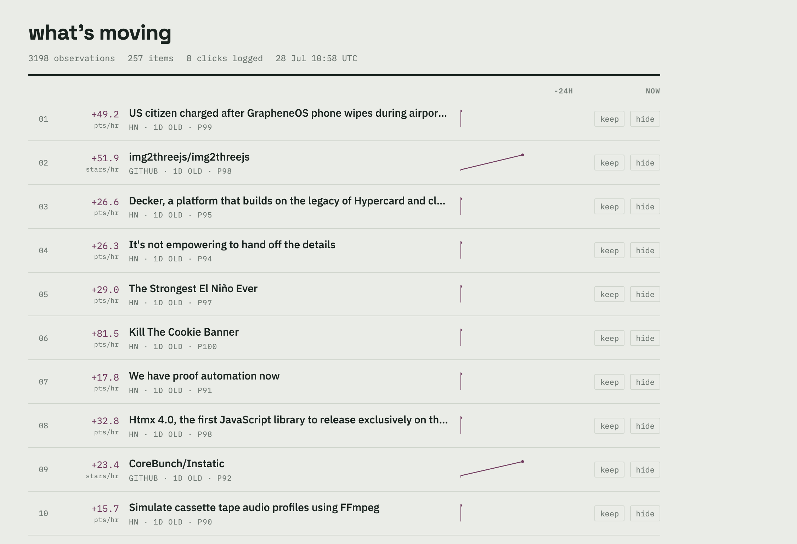

# trendagent

**Ranks tech news by how fast it's moving, not how popular it is.**

Popularity ranking has a structural problem: the most popular things are always
the things you already know about. Sorting Hacker News by points surfaces the
same established projects every day. What's actually useful is the *derivative* —
what's growing fastest right now, because that's the stuff you haven't heard of
yet.

trendagent measures the same items repeatedly and ranks on rate of change.



Each row shows an item's current rate and a sparkline of its real observation
history, all drawn on a shared 24-hour axis so the traces are directly
comparable. That's the point of the display: it separates *spiked and flatlined*
from *still climbing*, which a single number can't.

## How it works

```
  EventBridge / cron  ──hourly──▶  ingest
                                     │
              ┌──────────────────────┼──────────────────────┐
              ▼                      ▼                      ▼
        Hacker News              GitHub                 (arXiv, RSS)
        Algolia API            search API                  planned
              └──────────────────────┼──────────────────────┘
                                     ▼
                         observations  (append-only)
                       item · timestamp · metric · value
                                     │
                                     ▼
                     velocity  →  per-source percentile
                                  →  recency decay
                                     │
                     ┌───────────────┴───────────────┐
                     ▼                               ▼
              ranked page                     digest email
            (tracked clicks)                    (planned)
                     │
                     ▼
              click log  ──▶  training data for a learned ranker
```

## Design decisions

**Observations are append-only.** Every ingest run inserts a new
`(item, timestamp, metric)` row rather than updating a counter. A raw point
count is nearly worthless as signal — every popular thing has a high one. The
delta is the signal, and it only exists if you keep the history. This also makes
the collection schedule the one genuinely time-critical part of the system:
nothing here can be backfilled.

**Ranking is normalized per source.** HN points and GitHub stars move on
incomparable scales — a hot thread might gain 30 points/hour while a hot repo
gains 85 stars/hour. Ranking on raw velocity would just mean GitHub always wins.
Each item is scored against its own source's distribution instead.

**Percentile, not z-score.** These distributions are heavy-tailed power laws —
in a typical window the top item moves ~50x the median. A mean-and-standard-
deviation model would be dragged around by single viral outliers. Percentile
rank is robust to that.

**Decay is anchored to first sighting, not publication.** An early version used
each item's own creation date, which silently suppressed every GitHub result: a
repo created two years ago decays to zero no matter how fast it's climbing
today. But a two-year-old repo suddenly spiking is exactly the case worth
surfacing. Decay should measure how long something has been sitting on your
list, not how old the artifact is.

**Sources sit at different stages of the diffusion curve.** arXiv (research) →
GitHub (early adoption) → HN (practitioner awareness) → engineering blogs
(production validation) → vendor changelogs (enterprise arrival). A topic
appearing across several in sequence is evidence of a real trend rather than an
echo. Picking five sources from the same stage would just be five copies of the
same signal.

**Every link is a tracked redirect.** Opening an item routes through
`/c/{id}`, which logs the click and its rank position. Click history has the
same no-backfill property as the observation series, so it starts accumulating
from day one — well before there is a model to consume it.

## Stack

Python 3.12 · FastAPI · SQLite (Postgres-ready — `store.py` is the only module
that would change) · httpx · server-rendered HTML with inline SVG, no build step

## Running it

```bash
pip install -r requirements.txt
python -m trendagent init
python -m trendagent ingest       # run twice, an hour apart
python -m trendagent status
uvicorn trendagent.web:app --reload
```

Schedule ingestion — velocity is meaningless until there are at least two
observations of the same item:

```
0 * * * * cd /path/to/trendagent && .venv/bin/python -m trendagent ingest >> ingest.log 2>&1
```

`GITHUB_TOKEN` is optional and raises the search rate limit from ~10/min to ~30.

## Status

Working: hourly ingestion from HN and GitHub, velocity computation, per-source
normalized ranking, the web feed, click and keep/hide logging.

Not built yet: topic clustering across sources, the digest email, and the
learned ranker — the click data it will train on is still accumulating.

## Roadmap

1. ~~Ingest and storage~~
2. ~~Scoring and ranked page with click tracking~~
3. Topic extraction — canonicalize the same subject across sources so a repo, a
   thread, and a paper collapse into one tracked topic
4. Digest email via SES, with the page holding everything below the fold
5. Ranker trained on click history, replacing the static relevance score
